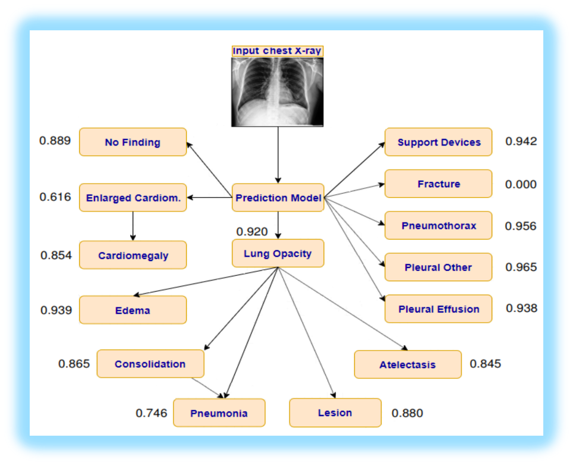

# Chest XRay Project

More than 60,000 patients

More than 180,000 images

14 pathologies

Uncertainties in the data were treated manually by resorting to pathologies associations:

We worked with DenseNet121 Embeddings

## Results
### Random Forest

### Logistic Regression

